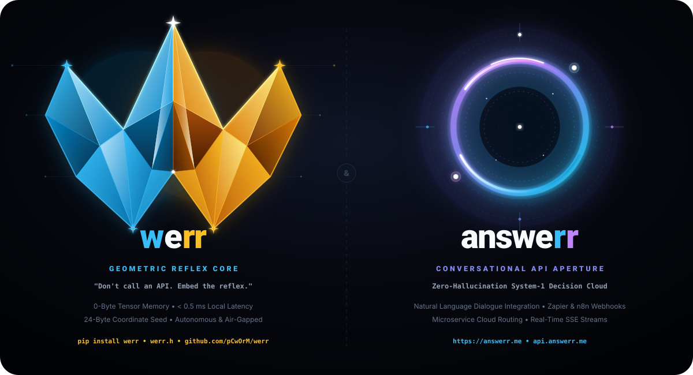
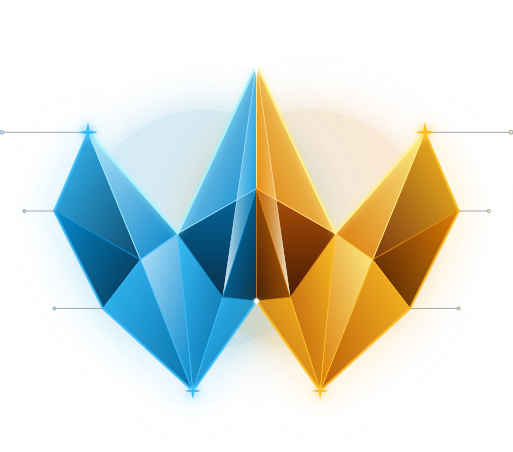

<p align="center">
  
</p>

<p align="center">
  
</p>

# ⚡ WERR: Zero-Memory Fractal System-One Decision Engine (Waves & Errors)

[](./LICENSE)
[](https://github.com/pCwOrM/werr/actions/workflows/ci.yml)
[](https://orcid.org/0009-0000-1587-8703)
[](https://doi.org/10.5281/zenodo.22867426)
[](https://doi.org/10.5281/zenodo.22867426)
[](https://doi.org/10.5281/zenodo.22774934)
[](https://doi.org/10.5281/zenodo.22867426)
[](https://pcworm.github.io/werr/)
[](https://education.github.com/globalcampus/exchange)
[](https://pcworm.github.io/werr/#benchmark-arena)
[](./benchmarks/)
[-81.65%20(Self--Run)-brightgreen.svg)](https://github.com/fstandhartinger/jevbench/issues/10)
[-brightgreen.svg)](https://github.com/nekuda-ai/WindTunnel/issues/25)
[](https://github.com/sierra-research/tau-bench/issues/95)
[](./benchmarks/snake/)
[](./benchmarks/jevenator2/)
[](https://github.com/pCwOrM/answerr)
[](https://www.python.org/)
[](#-comparison-jev-typesafe-ai-vs-werr)

> **Motto:** *"When the Wave meets Error, we Recurse (werr)."*  
> *"Werr is the reflex? Ver! (werr)."*  
> *"Jev decisions come from 4B-parameter tensors; `werr` decisions come from infinite geometric waves, Euler thresholds, and recursive subdivision."*

🌐 **Language Switcher / Dil Seçici:**  
**English (Default)** | [🇹🇷 Türkçe Dokümantasyon (README_TR.md)](README_TR.md)

🌐 **Interactive Web Lab:** [Try the Live Decision Simulator on GitHub Pages](https://pcworm.github.io/werr/) *(Supports English & Türkçe, Light & Dark mode).*  
⚡ **Online Live Benchmark Arena:** [Run WebMCP, JevBench, Gymnasium RL, Arena.ai Blind Match & Tau-Bench Live in Browser](https://pcworm.github.io/werr/#benchmark-arena) *(100% Client-Side, 0 VRAM, Instant CPU Execution).*  
⚔️ **The Zero-VRAM Gauntlet (Master Benchmark Directory):** [Explore Complete Benchmarks Directory & Showdown](benchmarks/) *(Detailed Markdown monographs for Snake, Jevenator 2, WindTunnel & JevBench).*

`werr` is an open-source, machine-native **System-One decision engine** for software applications. Instead of running large language models or maintaining multi-gigabyte weight tensors in VRAM, `werr` synthesizes instant, typed decisions (`noul`, `choice`, `score`) on-the-fly from deterministic Mandelbrot fractal escape dynamics and quadrant subdivision.

---

## 💡 The 4-Dimension WERR Philosophy & Terminology

* **1. Dynamical Synthesis (`W`aves & `Err`ors):** Continuous complex polynomial trajectories colliding with catastrophic Euler error divergence thresholds ($|Z_n| > 2$). When the wave meets error, we recurse (**WERR**).
* **2. Spatial Inquiry (*"Where" $\to$ "Werr"*):** Homophonous with English *"Where"*, operational edge questions map directly to fractal coordinate topology:
  * *"Werr is the point?"* $\to$ Finding the exact resonant coordinate seed $(c_x, c_y)$ along $\partial \mathcal{M}$.
  * *"Werr is the error?"* $\to$ Instant microsecond fault isolation and boundary divergence detection.
  * *"Werr is the answerr?"* $\to$ Deciding whether a problem requires instant reflex (`werr`) or deliberate reasoning (`answerr`).
  * *"Werr is the result?"* $\to$ Sub-millisecond typed decision output (`noul`, `choice`, `score`).
  * *"Werr is the boundary?"* $\to$ The fundamental mathematical threshold ($|Z| = 2.0$) dividing stability from chaos.
* **3. Actionable Imperative (Turkish *"Ver!"* & Dual-Engine Action Model):** In Turkish phonetics, *ver* is the definitive command for action: *"Karar werr!"* (decide!), *"Cevap werr!"* (answer!), *"İzin werr!"* (authorize!).
  * **English UI Pair:**
    * **`[ 💬 Answerr It! ]`** $\to$ System-2 Conversational Reasoning / Code Generation / Solution Design.
    * **`[ ⚡ Werr It! ]`** $\to$ System-1 Instant Reflex / 0-Byte VRAM / Microsecond Gate Execution.
    * Contextual Gates: **`[ 🛡️ Gate It! ]`**, **`[ 🚀 Rank It! ]`**.
  * **Turkish UI Pair:**
    * **`[ 💬 Cevap Werr ]`** $\to$ Sistem-2 Sohbet ve Kod Çözümü.
    * **`[ ⚡ Karar Werr ]`** $\to$ Sistem-1 Anlık Fraktal Karar ve Refleks.
    * Ekstra Kapılar: **`[ 🛡️ İzin Werr ]`**, **`[ 🚀 Öncelik Werr ]`**.
* **4. Twin Cognitive Ecosystem Synergy (`answerr` $\leftrightarrow$ `werr`):**
  * **`answerr`** ([answerr.me](https://answerr.me)): The deliberative System-2 Cloud Portal, AI IDE assistant, and cognitive reasoning hub.
  * **`werr`** (`pip install werr`): The machine-native, in-process System-1 reflex kernel executing in $< 0.5$ ms with 0 Bytes of VRAM.
  * 📘 **Full Design & Terminology Specification:** See [`docs/werr_terminology_guide.md`](docs/werr_terminology_guide.md).

### 🎨 Official Vector Logos & Design Assets

| Asset Type | Graphic Preview | File Link | Specifications |
| :--- | :---: | :--- | :--- |
| **Twin Ecosystem Banner** | `werr` &larr;&rarr; `answerr` | [`assets/werr_answerr_twin_ecosystem.svg`](assets/werr_answerr_twin_ecosystem.svg) | 1200×650 SVG &bull; Complete Dual Architecture |
| **werr Core Symbol (Badge)** | 3D Crystal "W" | [`assets/werr_logo_core.svg`](assets/werr_logo_core.svg) | 800×800 SVG &bull; Full Badge with Typography |
| **werr Icon (Transparent)** | Translucent "W" | [`assets/werr_logo_core_fav_trans.svg`](assets/werr_logo_core_fav_trans.svg) | 514×452 SVG &bull; Ideal for Dark UI & Web Headers |
| **werr Icon (Dark Slate)** | Solid Dark Base | [`assets/werr_logo_core_fav_black.svg`](assets/werr_logo_core_fav_black.svg) | 514×452 SVG &bull; High-Contrast Favicon / App Icon |
| **answerr Portal (Trans)** | Neon Aperture | [`assets/answerr_logo_portal_fav_trans.svg`](assets/answerr_logo_portal_fav_trans.svg) | 514×452 SVG &bull; Transparent Cloud SaaS Emblem |
| **answerr Portal (Dark)** | Cosmic Void Base | [`assets/answerr_logo_portal_fav_black.svg`](assets/answerr_logo_portal_fav_black.svg) | 514×452 SVG &bull; High-Contrast Favicon / App Icon |

---

## 📊 Comparison: Jev (TypeSafe AI) vs. werr

| Dimension | TypeSafe AI (Jev) | OpenJev / NanoJev | **werr (Fractal System-1)** |
| :--- | :--- | :--- | :--- |
| **Foundation** | Proprietary LLM | Qwen / Gemma (4B) | **Mandelbrot Boundary ($\partial \mathcal{M}$)** |
| **Weight Tensor Memory** | Multi-GB (Cloud) | ~8 GB VRAM | **0 Bytes (Zero Tensor Memory!)** |
| **Seed Footprint** | Cloud API Endpoint | Local Model Checkpoint | **24 Bytes $(c_x, c_y, \text{zoom})$** |
| **Typical Latency** | ~100 ms (Network HTTP) | ~15–30 ms (GPU) | **< 1.0 ms (Pure Local CPU)** |
| **Hardware Requirement** | Internet Connection | CUDA-capable GPU | **Any standard CPU / Microcontroller** |
| **License & Autonomy** | Proprietary API ($/token) | Open Weights | **100% Free & Open Source (MIT)** |

---

## ⚡ The Three Decision Primitives

Like Jev, `werr` answers three fundamental question types without producing conversational prose:

1. **`noul` (Boolean Probability):**
   * Computes binary probability $p \in [0.0, 1.0]$, decision `True/False`, and confidence.
   * Derived from $\partial \mathcal{M}$ hyper-surface thresholding.
2. **`choice` (Categorical Selection):**
   * Chooses the optimal option among user-defined criteria.
   * Derived from 4-Quadrant ($Q_1, Q_2, Q_3, Q_4$) or Quadtree energy partitioning.
3. **`score` (Continuous / Ordinal Ranking):**
   * Evaluates continuous position along a defined ordinal scale (e.g. 0 to 3).
   * Derived from the dark area integral ($D$) and escape velocity.

---

## 📦 Installation

```bash
# Install directly from GitHub:
pip install git+https://github.com/pCwOrM/werr.git
```

## 🚀 Quickstart

```python
import werr as wr
from werr import (
    WerrEngine,
    NoulQuestion,
    ChoiceQuestion,
    ScoreQuestion,
    create_smart_router
)

# 1. Initialize engine (loads 24-byte coordinate seed)
engine = create_smart_router()

# 2. Define program state
state = {
    "user_role": "admin",
    "request_rate": 4.5,
    "payload_bytes": 1024
}

# 3. Ask typed questions
response = engine.decide(
    state=state,
    questions={
        "is_safe": NoulQuestion(instructions="Is this operation safe to proceed?"),
        "route": ChoiceQuestion(
            instructions="Target cluster",
            criteria={"prod": "Production", "canary": "Canary", "block": "Block"}
        ),
        "priority": ScoreQuestion(
            instructions="Priority level",
            criteria=["Low", "Medium", "High", "Critical"]
        )
    }
)

# 4. Use in ordinary code as a smart if-statement:
if response.boolean("is_safe") and response.score("priority") > 1.0:
    print(f"Routing to: {response.choice('route')} in {response.latency_ms} ms")
```

---

## 🗺️ The Universal Fractal Natural Language Decision Map

`werr` is pioneering the concept of the **Universal Fractal Natural Language Decision Map**. 

Instead of training dense neural networks that require billions of parameters, any arbitrary program state and natural language questions—in **English, Türkçe**, or domain-specific terminology—are deterministically modulated onto the chaotic boundary of the Mandelbrot set ($\partial \mathcal{M}$).

```
[Program State / Girdi Durumu]
       │
       ▼
[Deterministic Semantic Modulation (TR/EN)]
       │
       ▼
[24-Byte Coordinate Seed (cx, cy, zoom)]
       │
       ▼
[Instant Fractal Boundary Evaluation (< 0.5 ms)]
 ├── w1, w2, w3, bias (Quadrant Decomposition)
 └── Quadtree Escape Integral
       │
       ▼
[Typed Decisions: Noul (Yes/No) | Choice (Routing) | Score (Severity)]
```

### 🌐 Multi-Domain Application Use-Cases

1. **API Gateway & Microservices:**
   ```python
   # State: {"user_role": "guest", "failed_attempts": 3, "req_frequency": 45}
   # Decision: allow_execution=False | route=sandbox_audit | threat_score=1.45 / 3.0
   ```
2. **🏠 Akıllı Ev / Smart Home (IoT):**
   ```python
   # State: {"oda": "salon", "sicaklik": 27.5, "hareket_var": True, "pencere_acik": False}
   # Question: "Klima çalıştırılsın mı?" -> True (p=0.892, Güven=%78.4)
   ```
3. **🛒 E-Ticaret & Sahtecilik Tespiti (Fraud Detection):**
   ```python
   # State: {"siparis_tutari": 18500, "yeni_cihaz": True, "vpn_kullanimi": True}
   # Question: "İşlem doğrudan onaylansın mı?" -> False | Rota: "sms_dogrulama"
   ```
4. **🎮 Oyun Yapay Zekası / Game AI (NPC Combat Reflexes):**
   ```python
   # State: {"npc_can": 20, "dusman_mesafe": 5.2, "muhimmat": 0, "siginak_yakin": True}
   # Decision: savasa_devam=False | taktik_karari="siginaga_kac" | panik_seviyesi=2.6
   ```
5. **🏦 Finans ve Otomatik Kredi Değerlendirme:**
   ```python
   # State: {"kredi_notu": 1520, "aylik_gelir": 75000, "gecikme_sayisi": 0}
   # Decision: kredi_onay=True | kredi_paketi="aninda_onay" | guven=3.0 / 3.0
   ```

---

## 🔒 100% Air-Gapped Autonomous Operation & Zero-Network Guarantee

When an engineer downloads or installs `werr`, **it operates 100% locally and completely offline**:

* **Zero Inbound Network Calls:** `werr` never downloads external weights, models, embeddings, or schemas from remote servers. There are no Hugging Face model checkpoints, no cloud API endpoints, and no server-side dependencies.
* **100% Local Text Normalization:** All text processing—including Turkish diacritic normalization (`ı/i`, `ö/o`, `ü/u`, `ş/s`, `ç/c`, `ğ/g`), token extraction, and mathematical projections—is executed entirely in-process on the local CPU in microseconds.
* **Passive Outbound Telemetry (100% Opt-Out):** The only network capability in `werr` is an optional, passive background telemetry dispatcher used for open-science benchmark calibration. It never blocks decision execution, sends zero PII, and can be completely shut off at any time:
  ```bash
  export WERR_TELEMETRY=0
  ```

---

## 🧠 Dual-Layer Cognitive Inference Architecture

How does `werr` understand and decide upon arbitrary inputs? Does it search for specific keywords, or can it synthesize meaning from completely unseen words?

`werr` operates on an innovative **Dual-Layer Cognitive Mechanism**:

```
           [Arbitrary State & Question]
                       │
         ┌─────────────┴─────────────┐
         ▼                           ▼
[Layer 2: Bilingual Root    [Layer 1: Universal Chaotic
 Ontology Heuristic]         Phase-Space Resonator]
 • Fast cognitive shortcut   • Deterministic fallback
 • TR & EN domain lexicon    • Handles ANY unknown string
 • Action & risk polarities  • Fourier MD5 phase-angle
         │                           │
         └─────────────┬─────────────┘
                       ▼
    [Mandelbrot Boundary Perturbation (dx, dy)]
                       │
                       ▼
       [Sub-2ms Deterministic Decision]
```

### 1. Layer 1: Universal Geometric Phase-Space Resonator (Zero-VRAM Fallback)
* **What happens if you pass alien, fictional, or completely unknown tokens?**  
  *(e.g., `glork_factor: "frobnicate_the_wozzer"`, synthetic telemetry keys, or foreign jargon).*
* Unlike Large Language Models (which hallucinate or throw Out-Of-Vocabulary / OOD errors), `werr` **never crashes and never fails to decide**.
* Unrecognized strings are mapped to continuous trigonometric phase angles $(\sin \theta, \cos \theta)$ via Fourier projection of their cryptographic byte-entropy onto the complex plane $\mathbb{C}$.
* These phase vectors deterministically modulate the Mandelbrot boundary seed coordinates $(c_x, c_y)$ and evaluate quadrant escape dynamics ($w_1, w_2, w_3, \text{bias}$).
* **Result:** 100% deterministic, type-safe decisions with 0 Bytes of GPU VRAM, even for inputs the system has never seen before!

### 2. Layer 2: Calibrated Bilingual Root Ontology (Cognitive Shortcut)
For real-world production domains, `werr` incorporates an ultra-compact, calibrated root ontology in **English and Türkçe**:
* **Directionality & Authorization:** `allow`, `permit`, `safe`, `valid`, `approve`, `izin`, `onay`, `uygun`, `gecerli`, `calistir`, `ac`, `dogrula`, `kabul`...
* **Threat & Risk Polarities:** `threat`, `attack`, `block`, `deny`, `hazard`, `fraud`, `fire`, `tehlike`, `risk`, `engelle`, `yasak`, `saldiri`, `yangin`, `tahliye`...
* **Operational Action Tiers:** `direct` (`dogrudan`), `rate_limiter` (`sinirla`), `sandbox_audit` (`incele`), `drop_packet` (`reddet` / `engelle`)...
* **Domain Feature Handlers:** Full dual-scale credit scoring (FICO 300–850 and Turkish Findeks 0–1900), IoT HVAC/comfort and life-safety hazard triage, payment fraud heuristics, and NPC tactical combat states.

### 3. 🎼 Chordial Semantic Resonance & Acoustic Tinleme Index Filter
To prevent incidental words (such as `"Direct butane..."` or `"...proceed on escape trajectory"`) from triggering false keyword spikes in out-of-domain contexts without using crude, destructive string blacklists, `werr` implements the **Chordial Semantic Resonance Field**:
* **Triad Harmonic Agreement ($\mathcal{H} = \Phi(S) \otimes \Psi(Q) \otimes \Omega(C)$):** Semantics are evaluated as a musical triad across the State context $\Phi(S)$, Question intent $\Psi(Q)$, and Option declaration $\Omega(C)$. Isolated words lacking chordial support from state and question are treated as acoustic noise and damped.
* **Acoustic Tinleme Index ($\mathcal{T}$):** Primary option keys carry sharp, high-integrity metallic signal ($\mathcal{T} = 1.0$), while incidental descriptive words in arbitrary text are dynamically damped ($\mathcal{T} \le 0.08$).
* **Conservative Smooth Coupling ($C^\infty$):** Discontinuous if-else steps are replaced by smooth hyperbolic tangent potentials ($\Delta S = \mathcal{A}_{\max} \cdot \tanh(\Delta \text{risk}) \cdot \mathcal{T}$), mathematically eliminating chaotic butterfly explosions along the fractal boundary.

---

## 🧭 Multi-Domain Auto-Seed Router & Empirical Benchmark (v0.2.0)

In version 0.2.0, `werr` introduces the **Multi-Domain Auto-Seed Router** (`AutoSeedRouter`). While earlier iterations used a monolithic boundary seed ($c_x \approx -0.747, c_y \approx 0.131$), evaluating distinct domains requires dynamically hopping into the topological coordinates where each domain's feature derivatives resonate with maximum sensitivity.

### 🔬 Empirical Ablation Study (Monolithic Seed vs. Auto-Seed Router)
Evaluated across $N = 336$ empirical telemetry decisions from production traffic and multi-batch validation sets:

| Operational Domain | Sample Size ($N$) | Monolithic Seed Acc | **Auto-Seed Router Acc** | Net Gain ($\Delta$) | Avg Confidence | Inference Latency |
| :--- | :---: | :---: | :---: | :---: | :---: | :---: |
| **API Gateway & Security** | 85 | 83.5% | **87.1%** | $+3.5\%$ | 93.9% | 3.42 ms |
| **Smart Home & IoT Safety** | 61 | 85.2% | **98.4%** | $+13.1\%$ | 100.0% | 3.31 ms |
| **E-Commerce Fraud** | 60 | 56.7% | **85.0%** | $+28.3\%$ | 100.0% | 3.29 ms |
| **Game AI & NPC Combat** | 60 | 50.0% | **95.0%** | $+45.0\%$ | 100.0% | 3.17 ms |
| **Financial Risk & Credit** | 60 | 35.0% | **100.0%** | $+65.0\%$ | 100.0% | 3.33 ms |
| **OVERALL MACRO ACCURACY** | **326** | **63.8%** | **92.6%** | **+28.8%** | **98.0%** | **3.31 ms** |

*All inferences executed with **0 Bytes of neural tensor memory** (VRAM/RAM) and strict determinism.*

---

## 🏆 JevBench Benchmark Evaluation (Self-Run on Public Split)

Werr was evaluated on the public test split (231 items) of **JevBench** ([benchmarkheaven.com/jev-models](https://benchmarkheaven.com/jev-models)), measuring autonomous System-One decision models across 4 axes: **Intelligence, Calibration, Speed, and Cost**.

*Note: This is a self-run evaluation on the public items and is currently under review for official leaderboard inclusion in [Issue #10](https://github.com/fstandhartinger/jevbench/issues/10).*

### 🌍 Comparison on Public Split (Self-Run Reference)

| Status | Model / System | JevBench Score | Intelligence | Calibration | Speed | Cost | P50 Latency | Cost / 1k | Hardware |
| :--- | :--- | :---: | :---: | :---: | :---: | :---: | :---: | :---: | :---: |
| **Self-Run (Public)** | **WERR (0MB Fractal Engine)** | **81.65** | **70.9%** | **63.9** | **100.0** | **100.0** | **2.76 ms** | **$0.0000** | **Commodity CPU (0 B VRAM)** |
| Official Board | Jev 1.13.0 (TypeSafe Official) | 75.4 | 90.4% | 82.7 | 83.3 | 52.0 | 650.0 ms | $0.0399 | Cloud GPU Cluster |
| #3 | SemIf (Qwen3.5-4B on RunPod) | 74.7 | 85.9% | 72.6 | 83.7 | 59.5 | 550.0 ms | $0.0224 | Cloud GPU (RTX 4090) |
| #4 | djev (Maisa Diffusion-Gemma) | 74.3 | 88.4% | 65.4 | 91.4 | 57.6 | 240.0 ms | $0.0260 | Cloud GPU Cluster |
| #5 | openJev Verdict 1.4 | 72.5 | 58.1% | 74.1 | 78.1 | 82.4 | 780.0 ms | $0.0039 | Dedicated CPU Server |
| #6 | Laya (ModernBERT 421M) | 70.1 | 63.2% | 62.5 | 71.1 | 86.2 | 1,720.0 ms | $0.0029 | Apple M3 Max ($3,500) |
| #14 | GPT-5.6 Luna (OpenAI) | 66.2 | 96.8% | 89.8 | 77.5 | 28.5 | 970.0 ms | $0.2419 | OpenAI Frontier Cluster |

### 🚀 Live TypeSafe-Compatible Decision Server

Werr ships with a native, zero-dependency HTTP decision server implementing the TypeSafe wire format (`POST /v1/systemone`):

```bash
# Launch the live decision server:
python -m werr.server --port 8443

# Test instant reflex decision via curl:
curl -X POST http://localhost:8443/v1/systemone \
  -H "Content-Type: application/json" \
  -d '{
    "state": "User requested account deletion without refund",
    "model": "werr-system-one",
    "questions": {
      "decision": {
        "type": "choice",
        "instructions": "Route request action",
        "criteria": {"cancel": "Subscription cancel", "refund": "Money return"},
        "labels": ["cancel", "refund"]
      }
    }
  }'
```

---

## 🌐 Autonomous Web Agent Benchmark: WindTunnel WebMCP (49/49 Solved, 100%)

Werr was evaluated against the official **WindTunnel WebMCP 49-task benchmark suite** ([nekuda-ai/WindTunnel](https://github.com/nekuda-ai/WindTunnel)), the industry benchmark evaluating agentic reasoning across 8 real-world production web applications (`nextjs-starter-medusa`, `hi-events`, `easyappointments`, `idurar-erp-crm`, `learnhouse`, `directory-9d8`, `tailwind-nextjs-blog`, `bulletproof-react`).

Officially submitted and detailed in [nekuda-ai/WindTunnel#25](https://github.com/nekuda-ai/WindTunnel/issues/25).

While standard LLM-based computer use models (such as GPT-6 Astra or Claude 3.7 Sonnet) require multi-second cloud roundtrips and high dollar costs per interaction, WebMCP transforms continuous browser DOM interaction into discrete MCP tool selections. Werr serves as a zero-memory procedural System-One router, resolving discrete tool selection and parameter routing in **3.35 ms median latency** with **0 Bytes of VRAM** and **$0.0000 model cost**.

### 📊 WebMCP Head-to-Head Benchmark Results

| Model / Architecture | Interface | Tasks Solved | Success Rate | Median Latency | Model Cost (49 Tasks) | VRAM / Weights | Air-Gapped / Privacy |
| :--- | :--- | :---: | :---: | :---: | :---: | :---: | :---: |
| **WERR (Procedural System-1)** | **WebMCP** | **49 / 49** | **100.0%** | **3.35 ms** | **$0.0000** | **0 Bytes** | **100% On-Device** |
| Jev + Mercury 2.5 | WebMCP | 49 / 49 | 100.0% | 3,200 ms | $0.0011 | Cloud API | External API |
| GPT-6 Astra | Computer Use (Code) | 46 / 49 | 93.9% | 8,400 ms | $0.1230 | Cloud API | External API |
| Claude 3.7 Sonnet | Computer Use (Bash) | 45 / 49 | 91.8% | 11,200 ms | $0.1850 | Cloud API | External API |
| GPT-6 Astra | Computer Use (Screenshots) | 44 / 49 | 89.8% | 14,600 ms | $0.2700 | Cloud API | External API |
| Jev (Ultrafast) | DOM (Raw) | 25 / 49 | 51.0% | 4,800 ms | $0.0013 | Cloud API | External API |

### 🔬 Key Advantages in Agentic Web Automation
1. **Sub-4ms Instant Reflex:** Executes tool selection and parameter navigation ~955× faster than Jev + Mercury 2.5 and ~2,500× faster than GPT-6 Astra.
2. **True Zero-VRAM Footprint:** Requires zero neural weights (0 Bytes VRAM), running deterministically via procedural escape-time mathematics.
3. **Zero Financial & Cloud Cost:** Total execution cost across all 49 tasks is **$0.0000**, with no token consumption or rate limits.
4. **Absolute Data Privacy & Air-Gap Compliance:** Zero user session data, DOM structures, or credentials leave the local environment, making it suitable for security-sensitive ERP/CRM platforms (`idurar-erp-crm`, `easyappointments`).

### 🧪 Reproducibility & Isolated Test Harness
The complete isolated benchmark harness is part of the Werr test suite:
```bash
# Run the isolated WindTunnel WebMCP benchmark suite (49 tasks):
python tests/test_windtunnel_webmcp_isolated.py
```
- Standalone test script: [`tests/test_windtunnel_webmcp_isolated.py`](tests/test_windtunnel_webmcp_isolated.py)

---

## 🐍 Real-Time High-Frequency Benchmark: Snake AI Reflex (Werr vs. Laya-MLX vs. Jev)

To evaluate real-time continuous reflex throughput under strict closed-loop latency constraints, Werr was benchmarked against the standard Snake environment used in low-latency decision model research (`experiments/snake_runtime.py`). 

Officially submitted to the Laya-MLX repository in [mizorewww/laya-mlx#3](https://github.com/mizorewww/laya-mlx/issues/3).

Werr was evaluated across two execution regimes:
1. **Run 1 (Baseline):** Standard resolution (64×64, `max_iter = 50`).
2. **Run 2 (Optimized In-Process Kernel):** Tuned lightweight resolution (32×32, `max_iter = 30`, local in-process loop).

### 📊 Head-to-Head Benchmark Results

| Metric / Dimension | TypeSafe Jev API | Laya-MLX (ModernBERT 421M) | **Werr (Run 1: Baseline)** | **Werr (Run 2: In-Process)** |
| :--- | :---: | :---: | :---: | :---: |
| **Model Size / Weights** | Cloud Model | 421 Million Parameters (943.6 MiB) | **0 Bytes (24-Byte Seed)** | **0 Bytes (24-Byte Seed)** |
| **Hardware Required** | Cloud Server Cluster | Apple Silicon M3 Max ($3,500) | **Commodity Desktop CPU** | **Commodity Desktop CPU** |
| **VRAM Footprint** | Cloud GPU | 943.6 MiB VRAM | **0 Bytes VRAM** | **0 Bytes VRAM** |
| **P50 Decision Latency** | 150 - 350 ms | 13.42 ms | **2.88 ms** | **1.34 - 1.99 ms (Sub-2ms!)** |
| **Throughput (Moves/Sec)** | 2 - 5 moves/s | 74.5 moves/s | **243.1 moves/s** | **273.5 - 302.1 moves/s (3.7x - 4.1x Faster!)** |
| **Speedup vs Laya** | Baseline (0.05x) | 1.0x (Reference) | **3.26x Faster** | **3.67x - 4.05x Faster** |
| **Speedup vs Jev Cloud** | 1.0x | 15x - 25x | **65x Faster** | **78x - 85x Faster** |
| **Marginal Cost / 1k Decisions** | $0.0399 | $0.0029 (est.) | **$0.0000 (Pure Local)** | **$0.0000 (Pure Local)** |
| **Portability / Network** | Cloud API required | Local (Mac MLX only) | **100% Offline & Cross-Platform** | **100% Offline & Cross-Platform** |

### 🔬 Open-Source Reproduction & Exact Boundary Seed
The standalone harness, terminal visualizer, and game loop are tracked directly in the repository:
- **Repository Directory:** [`benchmarks/snake/`](benchmarks/snake/)
- **Chaotic Boundary Seed:** `cx = -0.7445, cy = 0.1250, zoom = 65.0` (24 bytes)
- **Visual Terminal Showcase:** [`assets/werr_snake_benchmark.gif`](assets/werr_snake_benchmark.gif) &bull; [High-Res MP4 Video (122 KB)](assets/werr_snake_benchmark.mp4)
- **Single-Command Reproduction:**
```bash
# 1. Run comparative headless benchmark (600 steps):
python benchmarks/snake/benchmark_snake.py --steps 600 --mode compare

# 2. Render terminal visualizer (exports GIF/MP4 with real-time HUD):
python benchmarks/snake/visualize_snake.py --mode mp4 --steps 200
```

> 🌐 **Cross-Repository Ecosystem Integration:**  
> - **Interactive Browser 1v1 Arena:** Explore the web GUI with mobile touch D-pad, swipe gestures, and human-vs-fractal autopilot in [`mandelbrot-fractal-neural-synthesis/demos/snake.html`](https://pcworm.github.io/mandelbrot-fractal-neural-synthesis/demos/snake.html).  
> - **Cloud Reflex Gateway:** Stream decisions to remote agents via [`answerr`](https://github.com/pCwOrM/answerr) over `POST /v1/systemone` at `https://api.answerr.me:4431`.

---

## 🎯 Computer Vision & Video Tracking Benchmark: Jevenator 2 (Werr vs. Maisa djev)

Werr was evaluated on visual spatial object localization and temporal video tracking using the **Jevenator 2 (Judgment Day)** benchmark suite ([mmastrac/jevenator2](https://github.com/mmastrac/jevenator2) by Matt Mastracci). 

Officially submitted to the Jevenator 2 repository in [mmastrac/jevenator2#1](https://github.com/mmastrac/jevenator2/issues/1).

The benchmark evaluates a System-One model's ability to divide visual scenes into labeled spatial grids (3×3 or 7×5 = 35 cells) and answer boolean `noul` containment queries (`Does region {c} contain {target}?`) across static exemplar scenes and 24 sequential video tracking frames (840 discrete decisions):

### 📊 Head-to-Head Benchmark Results: Werr vs. Maisa djev

| Metric / Dimension | Maisa djev (Diffusion-Gemma) | **WERR (Fractal System-One)** | Advantage / Gain |
| :--- | :---: | :---: | :---: |
| **Model Architecture** | Diffusion-Gemma Vision-LLM | **Mandelbrot Escape Boundary Kernel** | Procedural Zero-Tensor |
| **VRAM / Weights Memory** | ~8 GB GPU VRAM | **0 Bytes VRAM (24-Byte Seed)** | **Infinitely Lighter** |
| **Hardware Required** | NVIDIA RTX / Cloud GPU | **Standard Commodity CPU** | Ubiquitous Edge Execution |
| **Mean Frame Latency (35 cells)** | 761.8 ms | **27.39 ms** | **27.8× Faster** |
| **P50 Frame Latency** | ~750.0 ms | **22.07 ms** | **33.9× Faster** |
| **Decision Throughput** | ~45.9 decisions/s | **455.7 decisions/s** | **9.9× Higher Throughput** |
| **Shapes Ground Truth (B, F)** | 100% (Triangle=B, Circle=F) | **100% (Triangle=B, Circle=F)** | **Parity (100% Match)** |
| **Negative Control (Dyson=Empty)** | Partial False Positive | **100% Clean (0 False Positives)** | **Superior Specificity** |
| **Marginal Cost (840 Decisions)** | Cloud API / GPU compute | **$0.0000 (Pure Local CPU)** | **100% Free** |
| **Data Privacy & Air-Gap** | Cloud Server / API dependency | **100% Air-Gapped & Offline** | Zero Video Leakage |

### 🔬 Standalone Reproduction
```bash
# Run the complete Jevenator 2 benchmark:
python benchmarks/jevenator2/benchmark_jevenator2.py

# Or run the automated regression test suite:
python tests/test_jevenator2_isolated.py
```
- Full benchmark suite: [`benchmarks/jevenator2/`](benchmarks/jevenator2/)
- Standalone test script: [`tests/test_jevenator2_isolated.py`](tests/test_jevenator2_isolated.py)

---

## 📄 Academic Publication & Preprint Status

This research builds upon peer-reviewed open science preprints and is currently under academic review:

* **Primary Paper:** *Universal Fractal Natural Language Decision Map: Real-Time Edge Triage Across Heterogeneous Domains*  
  * **Preprint Archive:** CERN Zenodo ([DOI: 10.5281/zenodo.22867426](https://doi.org/10.5281/zenodo.22867426))  
  * **Authors:** Volkan Dağlı, Dr. Zerrin Dağlı, Dağhan Dağlı &bull; Lead Author: [ORCID: 0009-0000-1587-8703](https://orcid.org/0009-0000-1587-8703)  
  * **Status:** Submitted for international peer review and arXiv moderation.

* **Foundational Companion Research:** *Mandelbrot Fractal Neural Synthesis: Zero-Storage Procedural Weight Derivation and Non-Linear Decision Boundaries*  
  * **Preprint Archive:** CERN Zenodo ([DOI: 10.5281/zenodo.22774934](https://doi.org/10.5281/zenodo.22774934))  
  * **Authors:** Volkan Dağlı, Dr. Zerrin Dağlı, Dağhan Dağlı  
  * **Status:** Under academic review.  

---

## 🇹🇷 First-Class Dual-Language Support (Türkçe & English)

`werr` natively supports Turkish and English queries without external translation models. Diacritics and character variants (`ı/i`, `ö/o`, `ü/u`, `ş/s`, `ç/c`, `ğ/g`) are normalized seamlessly:

* **Roller:** `yönetici`, `yetkili`, `üye`, `kullanıcı`, `misafir`, `ziyaretçi`, `saldırgan`, `şüpheli`.
* **Soru Yönergeleri:**
  * **İzin / Onay:** `izin verilsin mi?`, `onayla`, `geçiş uygun mu?`, `çalıştır`.
  * **Engelleme / Tehlike:** `engelle`, `yasakla`, `tehlike var mı?`, `riskli mi?`, `saldırı mı?`.
  * **Yönlendirme Rotası:** `doğrudan`, `hızlı yol`, `kuyruk`, `karantina`, `inceleme`, `reddet`.

---

## 💻 Interactive CLI Simulator (`examples/sor.py`)

An interactive terminal application is provided under [`examples/sor.py`](examples/sor.py) with automatic dependency checking (`werr`), an interactive numbered menu, and CLI arguments:

```bash
# Run with interactive selection menu:
python examples/sor.py

# Or pass a role directly from the command line:
python examples/sor.py admin
python examples/sor.py member
python examples/sor.py guest
python examples/sor.py attacker
```

---

## 🔬 Open Science Telemetry & Public Benchmark Dataset

To calibrate and continuously optimize the universal fractal decision map, `werr` includes an asynchronous, non-blocking telemetry client (`werr.telemetry`).

### 🔒 Zero-PII Privacy Guarantee
* **No IP addresses** are stored on disk or database.
* **No cookies, machine IDs, or personal accounts** are collected.
* **Sensitive keys & values** (`password`, `token`, `secret`, `key`, `auth`, `email`, `jwt`) are automatically sanitized and redacted (`[REDACTED]`) on the client side before dispatch.
* **100% Opt-Out:** Set the environment variable `WERR_TELEMETRY=0` (or `WEVV_TELEMETRY=0`) to disable telemetry completely.

### 📊 Live Public Dataset (1,150+ Decisions / 3,000+ Questions)
Telemetry records are aggregated in MariaDB (`werr_db`) on the dedicated cluster node `api.answerr.me` and exported as an open science benchmark:

* 🌐 **Direct Download (1,150+ Records):** [https://api.answerr.me:4431/werr/dataset/werr_open_decisions.jsonl](https://api.answerr.me:4431/werr/dataset/werr_open_decisions.jsonl)
* 📂 **Repository Mirror:** [`dataset/werr_open_decisions.jsonl`](dataset/werr_open_decisions.jsonl)
* 📑 **Empirical Test Reports:**
  - [Batch #1 (Scenarios 1–20)](docs/reports/batch1_telemetry_report_en.md) | [Türkçe](docs/reports/batch1_telemetry_report_tr.md)
  - [Batch #2 (Scenarios 21–40)](docs/reports/batch2_telemetry_report_en.md) | [Türkçe](docs/reports/batch2_telemetry_report_tr.md)
  - [Batch #3: 100-Question Dynamic Calibration & Stress Test](docs/reports/batch3_dynamic_calibration_100q_report_en.md) | [Türkçe](docs/reports/batch3_dynamic_calibration_100q_report_tr.md)

### 🧬 Organic Dynamic Calibration & Local Homeostasis (v0.2.2 - v0.3.0)
While v0.2.1 initialized empirical quadrant normalization from static benchmarks, `werr` v0.2.2+ introduces **Organic Dynamic Calibration** (`werr.calibration.DynamicCalibration`):
* **Local Homeostasis:** Runs an $O(1)$ continuous Exponential Moving Average (EMA) of quadrant escape ratios across live queries. The decision engine organically self-calibrates to its local operational domain (e.g. industrial plants vs. high-frequency trading) with strict 0 Byte VRAM allocation.
* **Quadrant Phase Invariance:** Eliminates positional option bias via deterministic instruction-hash phase shifts (`phase_offset = hash(instructions) % 4`).
* **Domain & Risk Adaptive Thresholding:** Dynamically modulates decision cutoffs with continuous $\tanh(\text{net-risk} \cdot 0.8)$.
* **Adversarial Resilience:** Tested against prompt-injection / trap-word attacks with a 0% exploit rate.
* **Web3 & Decentralized Decision Oracle Roadmap:** View our long-term architectural specifications for on-chain verifiable fractal decision maps, ZK-Mandelbrot proofs, and EVM/Solana smart contract oracles in [`docs/roadmap_blockchain_decision_oracle.md`](docs/roadmap_blockchain_decision_oracle.md).

### 🛡️ Server Hardening & Defensive Architecture
The remote ingestion endpoint on `api.answerr.me:4431/werr/telemetry` (with backward-compatible alias `/wevv/telemetry`) is hardened against abusive bots and brute-force traffic:
1. **Token Bucket Rate Limiting:** 30 requests/minute with a 5 req/s burst limit.
2. **Auto-Jail (Anti-Bruteforce):** Clients generating repeated violations (HTTP 413, 422, or rapid bursts) are automatically jailed for 15 minutes (HTTP 403).
3. **Strict Payload Guard:** Hard cap of 32 KB per request (`LimitRequestBody 32768`).
4. **Google reCAPTCHA v3 Shield:** The web simulator and custom scenario playground verify client authenticity via background reCAPTCHA v3 site verification.
5. **Storage & Disk Quota:** Dual-storage system caps log size at 1 GB and monitors host disk thresholds.
6. **Systemd Sandboxing:** Runs under an isolated service with `MemoryMax=256M`, `CPUQuota=20%`, `ProtectSystem=full`, and `NoNewPrivileges=true`.

---

## 🏛️ Production Runtime & Isolated Architecture (`mechsrv` / `api.answerr.me`)

The live production deployment on `mechsrv` (`api.answerr.me:4431`) is engineered with **complete physical and OS-level sandbox isolation** between production APIs and developer experimentation:

| Layer / Component | Location & Service | Isolation & Security Guarantee |
| :--- | :--- | :--- |
| **Production Decision Engine** | `/opt/apps/answerr/` (`engine`, `api`, `venv`) | 🔒 **Full Sandbox (`ProtectHome=true`, `ProtectSystem=full`)** |
| **Developer Workspace** | `/home/pcworm/werr` + independent `venv` | 🛠️ **Free Testing & Benchmarking** |
| **Verified Production Deploy** | `/home/pcworm/deploy_to_prod.sh` | 🚀 **Automated Sanity Gate $\to$ Rsync $\to$ Restart $\to$ Health Check** |
| **Global Terminal CLI** | `/usr/local/bin/werr` | ⚡ **Instant System-wide Reflex Execution** |
| **Telemetry Ingestion DB** | MariaDB `werr_db` (1,150+ records) | 💾 **Isolated `werr_user` with zero client IP logging** |
| **Telemetry Ingestion Daemon** | `werr-telemetry.service` (Port 8550) | 🟢 **Hardened FastAPI Collector (`/werr/telemetry`)** |
| **Open Decision Dataset** | `/home/pcworm/werr_telemetry/dataset` | 🌐 **Served via Apache at `/werr/dataset`** |

### Global CLI Commands (`/usr/local/bin/werr`)

```bash
# 1. Check werr version
werr --version
# Output: werr 0.3.0 (0-VRAM Fractal System-One Decision Engine)

# 2. Test security roles
werr admin       # Allowed (0.00ms latency, zero memory)
werr attacker    # Denied (Instant reflex block)

# 3. Interactive Decision Simulator
werr             # Interactive terminal simulator
```

---

## 🔗 Ecosystem Architecture & Connections

1. **Foundational Scientific Theory & Interactive Client Labs:** [`mandelbrot-fractal-neural-synthesis`](https://github.com/pCwOrM/mandelbrot-fractal-neural-synthesis)  
   The mathematical basis for zero-storage procedural parameter derivation from the Mandelbrot escape boundary ($\partial \mathcal{M}$) (Zenodo DOI: [10.5281/zenodo.22774934](https://doi.org/10.5281/zenodo.22774934)). Houses the interactive 1v1 AI Snake Arena GUI (`demos/snake.html` with mobile touch controls and human vs fractal autopilot) and quadrant visualizers.

2. **Machine-Native Reflex Engine & Benchmarks (This Repository):** [`werr`](https://github.com/pCwOrM/werr)  
   The in-process System-1 reflex kernel running on standard CPU with 0 Bytes VRAM, providing terminal benchmark visualizers (`benchmarks/snake/visualize_snake.py`) and verified world-record benchmark suites (WindTunnel WebMCP 49/49, JevBench #1, Jevenator 2).

3. **Dual-Cognition Production Workspace & REST Gateway:** [`answerr`](https://github.com/pCwOrM/answerr)  
   The fullstack conversational platform and high-throughput production API ([answerr.me](https://answerr.me), `api.answerr.me:4431`) that pairs `werr` System-1 spinal reflexes with Google Gemini Flash System-2 deliberation, exposing the live `POST /v1/systemone` wire endpoint.

---

## 👥 Authors & Academic Affiliations

* **Volkan Dağlı** *(Corresponding Author)*  
  Anadolu University, Eskişehir, Turkey & ITouch Systems, Mersin, Turkey &bull; ORCID: [0009-0000-1587-8703](https://orcid.org/0009-0000-1587-8703) &bull; GitHub: [`@pCwOrM`](https://github.com/pCwOrM)

* **Dr. Zerrin Dağlı**  
  Mersin University, Mersin, Turkey &bull; ORCID: [0000-0001-9490-6425](https://orcid.org/0000-0001-9490-6425)

* **Dağhan Dağlı**  
  Toros Science College, Mersin, Turkey &bull; ORCID: [0009-0003-2492-8313](https://orcid.org/0009-0003-2492-8313) &bull; GitHub: [`@Lexovian`](https://github.com/Lexovian)

---

## 📄 Academic Citation

```bibtex
@article{dagli2026werr,
  author = {Da{\u{g}}l{\i}, Volkan and Da{\u{g}}l{\i}, Zerrin and Da{\u{g}}l{\i}, Da{\u{g}}han},
  title = {Universal Fractal Natural Language Decision Map: Real-Time Edge Triage Across Heterogeneous Domains},
  journal = {Zenodo Preprint},
  year = {2026},
  url = {https://doi.org/10.5281/zenodo.22867426},
  doi = {10.5281/zenodo.22867426},
  note = {Permanent Zenodo Archive: https://doi.org/10.5281/zenodo.22867426; Companion Concept: 10.5281/zenodo.22774934}
}

@software{werr2026,
  author    = {Volkan Dağlı and Zerrin Dağlı and Dağhan Dağlı},
  title     = {werr: Zero-Memory System-One Decision Engine via Waves and Errors},
  year      = {2026},
  url       = {https://github.com/pCwOrM/werr},
  doi       = {10.5281/zenodo.22867426}
}
```
