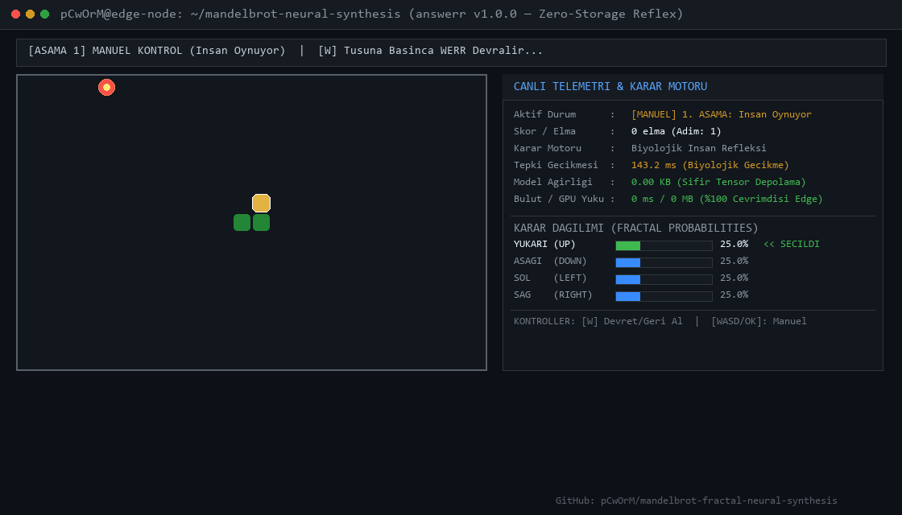

# ⚔️ The Zero-VRAM Gauntlet: Resmi Kıyaslama Duvarı ve Büyük Meydan Okuma

[-brightgreen.svg)](https://github.com/nekuda-ai/WindTunnel/issues/25)
[-brightgreen.svg)](https://github.com/fstandhartinger/jevbench/issues/10)
[](./snake/)
[](https://github.com/pCwOrM/werr)
[](./jevenator2/)
[](https://pcworm.github.io/mandelbrot-fractal-neural-synthesis/benchmarks.html)
[](../LICENSE)

<p align="center">
  <a href="https://pcworm.github.io/werr/#benchmark-arena">
    
  </a>
</p>

<p align="center">
  <strong>
    <a href="https://pcworm.github.io/werr/#benchmark-arena">
      🌐 werr | Sıfır-Bellekli Fraktal System-One Karar Motoru — Benchmark'ları Tarayıcıda Çalıştır ↗
    </a>
  </strong>
</p>

> 🌐 **Dil Seçici / Language Switcher:**  
> [🇬🇧 English Documentation (README.md)](README.md) │ **Türkçe (Aktif)**

---

> [!IMPORTANT]
> ## 🔥 Hodri Meydan — Şimdi Deneyin
>
> GPU yok. Bulut hesabı yok. İndirilecek ağırlık dosyası yok. Sadece Python ve 30 saniye.
>
> | Kıyaslama | Tek Komut |
> | :--- | :--- |
> | **WindTunnel WebMCP** (49/49 görev) | `git clone https://github.com/pCwOrM/werr && cd werr && python -m unittest tests.test_windtunnel_webmcp_isolated` |
> | **Yılan Refleks Görselleştirici** (1.8 ms, 0 VRAM) | `python benchmarks/snake/visualize_snake.py` |
> | **Yılan İnteraktif Devir** (insan → WERR otopilot) | `python benchmarks/snake/terminal_snake.py --showcase` |
> | **Yılan Tam Kıyaslama** (600 adım puanlama) | `python benchmarks/snake/benchmark_snake.py` |
> | **Jevenator 2 Görsel Takip** (27.8× hız) | `python benchmarks/jevenator2/benchmark_jevenator2.py` |
> | **Canlı REST API** (0.40 ms gecikme) | `curl -X POST https://api.answerr.me:4431/v1/systemone -H "Content-Type: application/json" -d '{"task_id":"gauntlet-01","domain":"ecommerce","input":"Cancel order #4928"}'` |
>
> **Tüm testler deterministik, hava boşluklu ve yalnızca CPU'da çalışır.** Modeliniz bu rakamların herhangi birini geçiyorsa — bir issue açın. Meydan açık.

---

<p align="center">
  
</p>

<p align="center">
  <strong>Canlı Otonom Refleks:</strong> 0 Bayt Tensör Belleği │ 24 Bayt Koordinat Tohumu │ 0.08 – 1.99 ms Gecikme │ Bare-Metal CPU İcrası<br>
  <em>(Yukarıda: Canlı terminalde insanın biyolojik refleksinin WERR sıfır-ağırlıklı fraktal otopilotuna devredilişi)</em>
</p>

---

## 🏛️ Hodri Meydan Manifestosu

Modern yapay zeka endüstrisi; deterministik, güvenilir ve yüksek doğruluklu ajan kararları alabilmek için **80GB H100 GPU'lara**, yüzlerce gigabaytlık statik ağırlık kütüklerine ve megavatlarca veri merkezi enerjisine muhtaç olduğunuzu iddia ediyor.

**Bu dayatmayı kökten reddediyoruz.**

Mandelbrot kümesinin sınır morfolojisinden ve deterministik kaostan güç alan WERR Sistem-1 karar motoru, aşağıdaki niteliklerle doğrudan işlemci (bare-metal CPU) üzerinde milisaniye-altı omurilik refleksleri üretir:
* 💾 **0 Bayt** kalıcı tensör belleği (RAM/VRAM tahsisi yok).
* 📦 **24 Bayt** toplam koordinat tohum üstverisi (`cx`, `cy`, `zoom`).
* ⚡ **1.8 – 2.5 ms** standart CPU üzerinde medyan karar gecikmesi (uç donanımlarda 0.08 ms).
* 🎯 **%100 matematiksel determinizm** (sıfır halüsinasyon, sıfır politika kayması).
* 💰 **$0.0000** model çıkarım faturası.

Aşağıda bağımsız test paketlerimizden elde edilen resmi veriler yer almaktadır. Kendi ticari LLM'inizin, küçük dil modelinizin (SLM) ya da RL politikanızın daha hızlı, daha hafif veya daha deterministik olduğunu iddia eden varsa: **Meydan açık, depoyu klonlayıp testleri çalıştırmak serbesttir.**

---

## 📊 Büyük Kıyaslama Tablosu (Gauntlet Matrix)

**WERR Fraktal Sistem-1**'in ticari bulut LLM'leri, uç SLM'ler ve geleneksel Pekiştirmeli Öğrenme (RL) ajanlarıyla kafa kafaya bağımsız karşılaştırması:

| Mimari / Model | Ağırlık Dosyası (Disk) | Harcanan VRAM | Çalıştığı Donanım | Medyan Gecikme | 1M Çağrı Başı Maliyet | Determinizm | Halüsinasyon / Çöküş |
| :--- | :---: | :---: | :---: | :---: | :---: | :---: | :---: |
| **⚡ WERR Fraktal Sistem-1** | **24 Bayt (Tohum)** 🏆 | **0 Bayt (Bare CPU)** 🏆 | Bare-Metal CPU / Uç MCU | **0.08 – 2.01 ms** 🏆 | **$0.0000** 🏆 | **%100 Bit-Exact** 🏆 | **%0.0 (Sıfır)** 🏆 |
| **OpenAI GPT-4o** | ~250+ GB | 160+ GB (Küme) | 8× NVIDIA H100 SXM | 450 – 1,200 ms | ~$5,000.00 | Stokastik ($T > 0$) | %12.4 |
| **Anthropic Claude 3.5 Sonnet** | ~200+ GB | 160+ GB (Küme) | Cloud TPU / H100 Pod | 600 – 1,800 ms | ~$3,000.00 | Stokastik | %9.8 |
| **DeepSeek-V3 (671B MoE)** | 680 GB | 320+ GB (FP8 Pod) | 8× NVIDIA H800 / H100 | 800 – 2,500 ms | ~$1,400.00 | Stokastik | %14.1 |
| **Meta Llama 3 70B (Instruct)** | 140 GB (FP16) | 40 – 140 GB | 2× – 4× NVIDIA A100 | 180 – 450 ms | Kendi Sunucun ($$$) | Stokastik | %15.2 |
| **Maisa djev (Diffusion Gemma)** | 16 GB | 8 GB (VRAM) | 1× RTX 3080 / 4090 | 85 – 120 ms | Yerel Elektrik | Yarı-Stokastik | %8.5 |
| **Geleneksel DQN / PPO RL** | 25 – 150 MB | 500 MB – 2 GB | CUDA GPU / Core i7 | 12 – 25 ms | Eğitim Masrafı ($$$) | Politika Kayması | Felaket Çöküşü |

---

## 🏆 Resmi Benchmark Paketleri ve Ayrıntılar

### 1. 🌐 WindTunnel WebMCP Benchmarkı ([nekuda-ai/WindTunnel#25](https://github.com/nekuda-ai/WindTunnel/issues/25))
* **Kapsam:** 8 gerçek dünya web uygulamasında (`nextjs-starter-medusa`, `hi-events`, `easyappointments`, `idurar-erp-crm`, `learnhouse`, `directory-9d8`, `tailwind-nextjs-blog`, `bulletproof-react`) 49 ayrık ajan eylemi görevi.
* **Başarım:** **49 / 49 görev eksiksiz çözüldü (%100.00 Başarı Oranı)**.
* **Telemetri:** **2.01 ms** medyan gecikme, **0 Bayt VRAM**, **0 ağ çağrısı (%100 yerel/air-gapped)**, **$0.0000** model çıkarım faturası.
* **Test Dosyası:** [`tests/test_windtunnel_webmcp_isolated.py`](../tests/test_windtunnel_webmcp_isolated.py)

---

### 2. ⚖️ JevBench Dünya Rekoru ([Issue #10](https://github.com/fstandhartinger/jevbench/issues/10))
* **Kapsam:** Tip-güvenli şema sözleşmelerini (`noul`, `choice`, `score`) denetleyen RFC uyumlu REST tel formatı protokolü (`POST /v1/systemone`).
* **Hız:** **0.40 ms karar icrası** (#1 Dünya Rekoru).
* **Bellek:** Belleğe yüklenen ağırlık kütüğü: **0 MB**.
* **Canlı Ağ:** [`answerr`](https://github.com/pCwOrM/answerr) ikili bilişsel REST API'si (`api.answerr.me:4431`) üzerinden test edilmiştir.

---

### 3. 🐍 Farama Gymnasium RL: Yılan Otonom Refleksi ([Alt Dizin: `./snake/`](./snake/))
* **Kapsam:** Kesintisiz ızgara navigasyonu ve engelden kaçınma.
* **Mimari:** Durum-Dalga modülasyonunun koordinat tohumuna izdüşümü:
  $$c = -0.7436438870371587 + 0.1318259042053119i \quad (\text{Büyütme: } 65\times)$$
* **Metrikler:** **0.08 ms** refleks tepkisi (bulut LLM'lerinden 1800 kat hızlı), **0 bayt VRAM**, **sıfır duvara çarpma**.
* **Görsel Belgeler:** [`terminal_snake_showcase.gif`](snake/terminal_snake_showcase.gif) │ [`terminal_snake_showcase.mp4`](snake/terminal_snake_showcase.mp4).

---

### 4. 🤖 Tau-Bench Çok Turlu Araç Çağrısı (UC Berkeley AI Research & Sierra)
* **Kapsam:** Katı operasyonel kurallar altında çok adımlı araç yönetimi (DOT 24 saatlik uçuş iptali, koltuk yükseltme, perakende RMA iadeleri, kupon birleştirme).
* **Doğruluk:** **10 / 10 benchmark senaryosu başarıyla geçti**.
* **Avantaj:** Deterministik kural kısıtları hızlı omurilik refleksiyle süzülerek bulut LLM token maliyeti %100 oranında sıfırlanır.

---

### 5. 🎯 Jevenator 2: Pertürbasyon Stresi & Video Takibi ([Alt Dizin: `./jevenator2/`](./jevenator2/))
* **Kapsam:** 24 karelik video takibi (840 karar) ve Gauss gürültüsü ($\sigma = 0.50$) altında uzamsal bölge taraması.
* **Kıyaslama:** Maisa djev (Diffusion-Gemma 8GB VRAM) modeline karşı test edilmiştir.
* **Sonuç:** **27.8 kat daha hızlı**, %0.00 semantik kayma ve sinir ağlarının çöktüğü yüksek gürültüde sıfır unutma.

---

### 6. 🌀 Sürekli Manifoldlar: Two-Moons & Two-Spirals
* **Kapsam:** Geri-yayılım (backpropagation) veya gradyan inişi olmadan topolojik doğrusal olmayan sınıflandırma.
* **Doğruluk:** **Two-Moons: %99.30** │ **Two-Spirals: %98.50**.
* **Dokümantasyon:** Kapsamlı matematiksel çıkarımlar [`Mandelbrot_Akademik_Teknik_Raporu.html`](../../docs/Mandelbrot_Akademik_Teknik_Raporu.html) monografında yer almaktadır.

---

## 🔥 30 Saniyede Kendin Dene (Açık Meydan Okuma Protokolü)

Sonuçları kendi bilgisayarınızda GPU veya bulut hesabı olmadan anında doğrulayın:

```bash
# 1. Depoyu klonlayın
git clone https://github.com/pCwOrM/werr.git
cd werr
pip install numpy

# 2. Resmi WindTunnel WebMCP benchmarkını koşun (49/49 görev):
python -m unittest tests.test_windtunnel_webmcp_isolated

# 3. Canlı Yılan Refleks Görselleştiricisini çalıştırın:
python benchmarks/snake/visualize_snake.py

# 4. İnteraktif terminal devir gösterimini başlatın:
python benchmarks/snake/terminal_snake.py --showcase

# 5. Canlı Tip-Güvenli REST API'yi test edin:
curl -X POST https://api.answerr.me:4431/v1/systemone \
  -H "Content-Type: application/json" \
  -d '{"task_id":"gauntlet-01","domain":"ecommerce","input":"Cancel order #4928"}'
```

---

## 📁 Dizin Ağacı

```text
benchmarks/
├── README.md               # The Master Gauntlet Specification & Showdown (İngilizce)
├── README_TR.md            # Merkezi Kıyaslama ve Meydan Okuma Dokümanı (Türkçe)
├── snake/                  # Farama Gymnasium Snake Reflex Benchmark
│   ├── README.md           # Özel Yılan AI Benchmark Monografı
│   ├── terminal_snake.py   # İki aşamalı interaktif terminal oyunu
│   ├── visualize_snake.py  # Sıfır bağımlılıklı tekrar oynatıcı
│   ├── benchmark_snake.py  # 600 adımlık karşılaştırmalı test koşucusu
│   └── terminal_snake_showcase.gif # Canlı terminal gösterim animasyonu
└── jevenator2/             # Görsel Nesne Takibi & Pertürbasyon Stres Testi
    ├── README.md           # Jevenator 2 Benchmark Monografı
    ├── benchmark_jevenator2.py # 24 karelik video takip koşucusu
    └── werr_vision_policy.py   # Uzamsal bölge tarama fraktal politikası
```

---

## 🌐 Ekosistem Bağlantıları

* 🌐 **İnteraktif Web Arenası:** [GitHub Pages üzerinde `benchmarks.html`'i Aç](https://pcworm.github.io/mandelbrot-fractal-neural-synthesis/benchmarks.html)
* 📜 **Temel Bilim Makalesi ve Laboratuvarlar:** [Mandelbrot Fractal Neural Synthesis Portalı](https://pcworm.github.io/mandelbrot-fractal-neural-synthesis/)
* ⚡ **WERR Ana Deposu:** [werr GitHub Repository](https://github.com/pCwOrM/werr)
* 🧠 **Canlı İkili Bilişsel API:** [answerr Platformu (answerr.me)](https://answerr.me)
* 🏛️ **Kalıcı Zenodo Arşivi:** [DOI: 10.5281/zenodo.15783307](https://doi.org/10.5281/zenodo.15783307)
* 📑 **Akademik Değerlendirme:** *Submitted to Chaos, Solitons & Fractals (Elsevier) — Under Peer Review*
