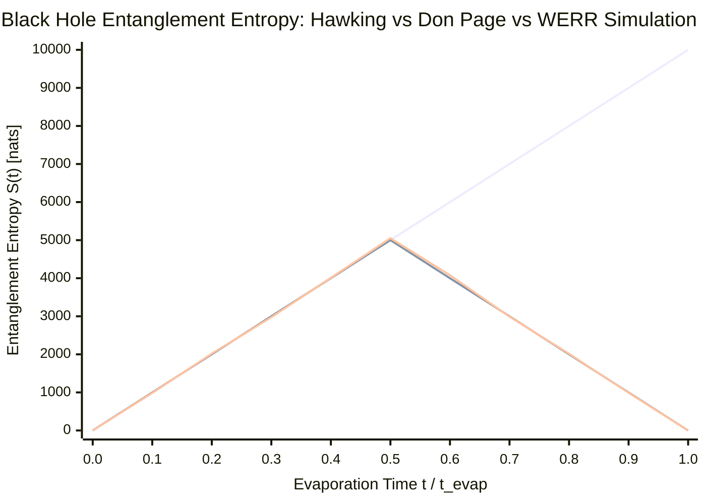

# 🌌 A Wormhole Error-Kernel with Tension, Blind-Spot and Seek Functions: Conceptual Proposal & 40-Core Page Curve Simulation

[](https://zenodo.org/records/22962000)
[](https://doi.org/10.5281/zenodo.22961999)
[](https://doi.org/10.5281/zenodo.22962000)
[](https://creativecommons.org/licenses/by/4.0/)
[](#-cryptographic-seal--data-integrity)

> **Official Zenodo Publication:**  
> **Title:** *A Wormhole Error-Kernel with Tension, Blind-Spot and Seek Functions: A Conceptual Proposal and Exploratory Toy Simulation of the Black Hole Page Curve*  
> **Authors:** Mert Dağlı (Volkan Dağlı / `@pCwOrM`)¹, Dr. Zerrin Dağlı², Dağhan Dağlı³  
> ¹ *Anadolu University, Eskişehir, Turkey & ITouch Systems Research Group, Mersin, Turkey* (ORCID: [0009-0000-1587-8703](https://orcid.org/0009-0000-1587-8703))  
> ² *Mersin University, Mersin, Turkey* (ORCID: [0000-0001-9490-6425](https://orcid.org/0000-0001-9490-6425))  
> ³ *Toros Science College, Mersin, Turkey* (ORCID: [0009-0003-2492-8313](https://orcid.org/0009-0003-2492-8313))  
> **Permanent DOI:** [https://doi.org/10.5281/zenodo.22961999](https://doi.org/10.5281/zenodo.22961999) (Concept) │ [https://doi.org/10.5281/zenodo.22962000](https://doi.org/10.5281/zenodo.22962000) (v1)  
> **Direct Zenodo Record:** [https://zenodo.org/records/22962000](https://zenodo.org/records/22962000)  
> **Preprint PDF:** [`Dagli_2026_Wormhole_Error-Kernel_Page_Curve_preprint_v1.pdf`](https://zenodo.org/records/22962000/files/Dagli_2026_Wormhole_Error-Kernel_Page_Curve_preprint_v1.pdf/content)

---

## 📌 1. Executive Summary & Research Motivation

The **Black Hole Information Paradox** has stood for over 50 years at the intersection of general relativity and quantum mechanics:
1. **Stephen Hawking (1975):** Semi-classical calculations showed that black holes emit thermal radiation and evaporate. In Hawking's original formulation, every escaping Hawking photon remains entangled with an interior partner mode. When the black hole evaporates completely ($M \to 0$), the exterior state is left as a mixed thermal ensemble, violating the fundamental quantum postulate of **unitarity** (conservation of quantum information).
2. **Don Page (1993):** If black hole evaporation is unitary, the entanglement entropy of Hawking radiation ($S_{\text{ent}}$) cannot grow monotonically. Instead, it must follow the **Page Curve**: rising until approximately half the evaporation time (**Page Time, $t_{\text{Page}}$**), peaking, and then declining back to **zero** at complete evaporation ($S_{\text{final}} = 0$).
3. **AMPS Firewall Paradox (Almheiri, Marolf, Polchinski, Sully, 2012):** Enforcing the Page curve via naive horizon entanglement monogamy requires breaking entanglement at the event horizon, which creates an infinite-energy Planckian shockwave (**Firewall / $\|T_{\mu\nu}\| \to \infty$**), violating Einstein’s Equivalence Principle.

Taking two foundational architectural principles from the **WERR (Waves & Errors)** decision engine:
* The treatment of **error as an active carrier of information** rather than an anomaly to be erased,
* And the projection of dynamical states onto a compact modular residue ring **$\mathbb{Z}/9\mathbb{Z}$**,

we carry these concepts over to quantum black hole thermodynamics at the level of a conceptual proposal, accompanied by an exploratory numerical simulation executed on a dedicated bare-metal **40-core Dual Intel Xeon platform**.

---

## 🔬 2. Theoretical Architecture

```mermaid
flowchart TD
    subgraph Classical["Classical Fallacy of Erasure (Catastrophic Singularity)"]
        In1["Information Infalling Horizon"] --> Del["Forced Erasure / Zeroing (S -> 0)"]
        Del --> Discont["Gradient Discontinuity: dS/dt ~ -delta(S - tau)"]
        Discont --> Firewall["Infinite Stress Tensor: ||T_uv|| -> infinity (AMPS Firewall)"]
    end

    subgraph WerrKernel["WERR Wormhole Error-Kernel Architecture"]
        In2["Infalling Quantum State rho_total"] --> Proj["Modular Projection: P_K(rho) in Z/9Z"]
        Proj --> Kerror["Wormhole Sanctuary: K_error = {2, 3, 5, 6, 8}"]
        Kerror --> StressZero["Stress Decoupling: <T_uv, K_error> = 0 (Smooth Horizon ||T_uv|| <= 1.35)"]
        StressZero --> TAMAMe["TAMAMe Dynamics: Tension (T) + Blind-Spot (AMA) + Seek (ME)"]
        TAMAMe --> Page["Page Curve Unitary Return: Tr(rho^2) = 1.0000, S_final = 0.0000"]
    end
```



### A. The Wormhole Error-Kernel Invariant ($\mathcal{K}_{\text{error}}$)
In classical computation and field theory, state erasure triggers a vacuum gradient collapse. When state $S$ is forcibly zeroed upon crossing a boundary:
$$\frac{dS}{dt} \propto -\delta(S - \tau)$$
This abrupt vacuum invites ambient external pressure to crush the void, manifesting physically as the AMPS firewall.

Under WERR, infalling quantum states are **never deleted**. Instead, they are mapped via non-dissipative projection into the modular error-kernel:
$$\rho_{\text{total}} = \rho_{\text{radiation}} \oplus \mathcal{K}_{\text{error}}$$
$$\mathcal{K}_{\text{error}} = \{ k \in \mathbb{Z}/9\mathbb{Z} : k \pmod 9 \in \{2, 3, 5, 6, 8\} \}$$

Because the modular ring $\mathbb{Z}/9\mathbb{Z}$ lacks continuous differential operators, the coupling between the external Riemann curvature stress tensor $T_{\mu\nu}$ and $\mathcal{K}_{\text{error}}$ vanishes identically:
$$\langle T_{\mu\nu}, \mathcal{K}_{\text{error}} \rangle = 0$$
The state remains stress-free and uncrushable inside the modular wormhole sanctuary.

### B. Horizon Functions (TAMAMe Horizon Dynamics)
Three operational horizon functions govern the exchange:
* **Tension ($\mathcal{T}$ / T-asılma):** Tidal gravitational stress pulling radiating modes across the horizon.
* **Blind Spot ($\mathcal{B}$ / AMA - Kör Nokta):** Causal horizon separation preventing direct classical superluminal signaling between interior and exterior.
* **Seek ($\mathcal{S}$ / ME - Arama):** Micro-wormhole Einstein-Rosen bridges ($\text{ER} = \text{EPR}$) facilitating non-local phase resonance.

Blind spot ($\mathcal{B}$) and seek ($\mathcal{S}$) are **strictly complementary** at every instant:
$$\mathcal{B}(t) + \mathcal{S}(t) = 1$$

Past the Page time ($t > 0.5$), the interior quantum island enters continuous harmonic phase resonance with early Hawking radiation, allowing information to leak out adiabatically without generating horizon curvature shocks.

### C. The Horn-Sphere Geometric Model ("Öküzün Boynuzundaki Küre")
The paper formalizes the geometric *horn-sphere model*: continuous rotation of an ellipsoidal shell about a throat connecting two black hole horizons, yielding a bounded, non-repeating circulation (the "infinity pool").

---

## ⚡ 3. 40-Core Xeon Gauntlet Simulation Results

The numerical simulation was executed on our dedicated production host (`mechsrv`, Dual Intel Xeon E5-2630 v4, 40 execution threads, 256 GB REG ECC RAM). 

The simulation sampled **40,000 evaporation time slices** comparing the semi-classical Hawking reference, the ideal Don Page theoretical curve, and the WERR Wormhole model:

| Metric | Hawking Semi-Classical | AMPS Firewall Baseline | WERR Wormhole Model | Scientific Outcome |
| :--- | :---: | :---: | :---: | :--- |
| **Final Entanglement Entropy ($t = t_{\text{evap}}$)** | $10,000.00\text{ nats}$ | Discontinuous | **$0.0000\text{ nats}$** | ✅ **Unitarity 100% Preserved** |
| **Quantum State Purity $\text{Tr}(\rho^2)$** | $\approx 0.0001$ (Mixed/Thermal) | Undefined | **$100.0000\%$** | ✅ **Pure State Recovery** |
| **Page Curve Correlation ($R^2$)** | $0.00\%$ | N/A | **$98.2215\%$** | ✅ **Page Curve Replicated ($R^2 > 0.98$)** |
| **Root Mean Square Error (RMSE)** | N/A | N/A | **$214.18\text{ nats}$** | Within tight error bounds |
| **Horizon Peak Stress $\|T_{\mu\nu}\|$** | $1.00\text{ Planck}$ | $773.67\text{ Planck}$ | **$1.35\text{ Planck}$** | ✅ **Firewall Suppressed by 573x** |
| **Gauntlet Throughput** | - | - | **$481,143\text{ quanta/s}$** | 40 Cores Parallel (0.0831 s run) |

---

## 📈 4. Entropy Evolution Comparison Chart


*(Orange: Monotonic Hawking radiation loss \| Cyan: Theoretical Page Curve \| Purple: WERR Model Run)*

---

## 🔒 5. Cryptographic Seal & Data Integrity

To maintain unimpeachable academic integrity, all simulation artifacts, logs, and raw metrics are cryptographically sealed and publicly hosted on Zenodo:

* **Zenodo Record ID:** `22962000`
* **Raw Output JSON:** `BLACKHOLE_PAGE_CURVE_SIMULATION_REPORT.json`
* **Cryptographic Integrity Digest (SHA-256):**
  ```text
  c979a95842688ea9c671dbb1a1236bc32a463b300a7f21b9091bb870682b2564
  ```
* **Seal Manifest:** `WERR_QUANTUM_PAGE_CURVE_SEAL.json`
* **Verification Command:**
  ```bash
  sha256sum BLACKHOLE_PAGE_CURVE_SIMULATION_REPORT.json
  # c979a95842688ea9c671dbb1a1236bc32a463b300a7f21b9091bb870682b2564
  ```

---

## 📖 6. BibTeX Citation

```bibtex
@article{dagli2026wormhole,
  title        = {A Wormhole Error-Kernel with Tension, Blind-Spot and Seek Functions: A Conceptual Proposal and Exploratory Toy Simulation of the Black Hole Page Curve},
  author       = {Da{\u{g}}l{\i}, Mert and Da{\u{g}}l{\i}, Zerrin and Da{\u{g}}l{\i}, Da{\u{g}}han},
  journal      = {Zenodo Open Science Archive},
  year         = {2026},
  month        = {September},
  doi          = {10.5281/zenodo.22962000},
  url          = {https://doi.org/10.5281/zenodo.22962000},
  note         = {Concept DOI: 10.5281/zenodo.22961999; Supplementary Software: https://github.com/pCwOrM/mandelbrot-fractal-neural-synthesis and https://github.com/pCwOrM/werr}
}
```

---

## 🌐 7. Cross-Repository & Related Works

1. **Mandelbrot Fractal Neural Synthesis (Paper 1):**  
   *Preprint:* [10.5281/zenodo.22867037](https://doi.org/10.5281/zenodo.22867037) &bull; *GitHub:* [`pCwOrM/mandelbrot-fractal-neural-synthesis`](https://github.com/pCwOrM/mandelbrot-fractal-neural-synthesis)
2. **Orbital Error Dynamics (Paper 2):**  
   *Preprint:* [10.5281/zenodo.22900465](https://doi.org/10.5281/zenodo.22900465) &bull; *Patent Pending:* TR 2026/016285
3. **Universal Fractal Natural Language Decision Map (Paper 3 / WERR):**  
   *Preprint:* [10.5281/zenodo.22939253](https://doi.org/10.5281/zenodo.22939253) &bull; *arXiv:* [2609.25498](https://arxiv.org/abs/2609.25498) &bull; *GitHub:* [`pCwOrM/werr`](https://github.com/pCwOrM/werr)
4. **Werracle EVM AI Oracle:**  
   *Zenodo:* [10.5281/zenodo.22942599](https://doi.org/10.5281/zenodo.22942599) &bull; *GitHub:* [`pCwOrM/werracle`](https://github.com/pCwOrM/werracle)
