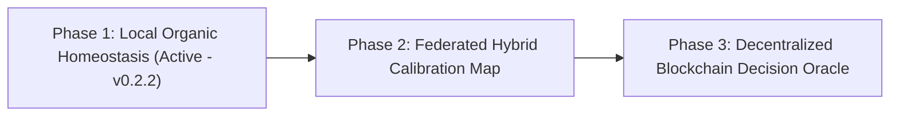

# 🌐 WEVV Web3 Roadmap: Decentralized Fractal Decision Map & On-Chain AI Oracle

## 1. Executive Summary

Traditional Deep Learning models (Large Language Models, Diffusion Networks, Multi-Billion Parameter Transformers) cannot run natively on-chain. Their gigabyte-scale weight tensors, massive memory demands, and GPU non-determinism make execution inside Ethereum Virtual Machine (EVM), Solana (Sealevel), or CosmWasm impossible due to exorbitant gas costs and block size limits.

`wevv` fundamentally breaks this constraint. Operating as a **Zero-Memory System-One Decision Engine**, `wevv` synthesizes deterministic probabilistic decisions (`noul`, `choice`, `score`) purely from mathematical Mandelbrot escape dynamics.

---

## 2. The Three-Phase Evolution

### Phase 1: Local Organic Homeostasis (Completed in v0.2.2)
- **Mechanism:** Continuous Exponential Moving Average (EMA) calibration running locally in $O(1)$ time with 0 Bytes VRAM.
- **Homeostasis:** Each node adapts its quadrant baseline normalization ($\bar{\mathcal{Q}}$) organically to its specific operational environment (e.g., high-throughput IoT vs. algorithmic finance), creating a personalized fractal decision reflex.

### Phase 2: Federated Hybrid Synchronization (Next Horizon)
- **Mechanism:** Periodic cryptographic aggregation between local nodes and public scientific telemetry nodes (`mechsrv.itouch.fi`).
- **Differential Privacy & Proof-of-Telemetry:** Nodes submit sanitized telemetry hashes without exposing internal environment states, maintaining zero-PII guarantees.
- **Hybrid Weight Blending:**
  $$\bar{\mathcal{Q}}_{\text{effective}} = (1 - \lambda) \cdot \bar{\mathcal{Q}}_{\text{local}} + \lambda \cdot \bar{\mathcal{Q}}_{\text{global}}$$

### Phase 3: Decentralized Blockchain Decision Oracle (Web3 / On-Chain)
- **Zero-Storage Block Payload:** A complete `wevv` decision proof requires only **24 Bytes** $(cx, cy, \text{zoom})$ plus the state hash. An entire Ethereum or Solana block can settle thousands of verifiable fractal decisions simultaneously.
- **On-Chain Verifiability (Zero-Knowledge / Deterministic Bytecode):**
  Because $z_{n+1} = z_n^2 + c$ uses pure arithmetic without neural weights, any smart contract can verify a decision in $< 5\text{ ms}$ with negligible gas fees.
- **Proof-of-Fractal-Convergence Consensus:**
  Decentralized validator nodes participate in continuous coordinate consensus. Malicious or adversarial telemetry injections are cryptographically and geometrically penalized on-chain.
- **Decentralized AI Oracle for DeFi & Web3 Automation:**
  Smart contracts (lending protocols, automated market makers, decentralized gaming NPCs, DAO governance triages) execute fast, autonomous System-1 reflexes without relying on centralized Web2 API bridges.

---

## 3. Technical Specifications for Smart Contract Integration

| Specification | Traditional LLM / Oracle | **wevv Fractal Decision Oracle** |
| :--- | :--- | :--- |
| **Model Size on Chain** | Impossible (>4 GB) | **0 Bytes (Mandelbrot Operator)** |
| **State Footprint** | Gigabytes | **24 Bytes per seed $(cx, cy, \text{zoom})$** |
| **Gas Cost** | Millions (Prohibitive) | **O(1) Arithmetic (< 50,000 gas)** |
| **Verification Latency** | Seconds / Network Roundtrip | **< 5 ms on-chain** |
| **Consensus Security** | Centralized API signer | **Decentralized Proof-of-Convergence** |
| **Privacy** | Exposes prompt data | **Zero-PII / Zero-Knowledge State Hashes** |

---

## 4. Citation & Architectural Record
This roadmap document preserves the foundational design decisions formulated during the 969-decision empirical milestone of `wevv`. Future development sprints can directly reference this document when implementing the on-chain Solidity/Rust verifiers.
